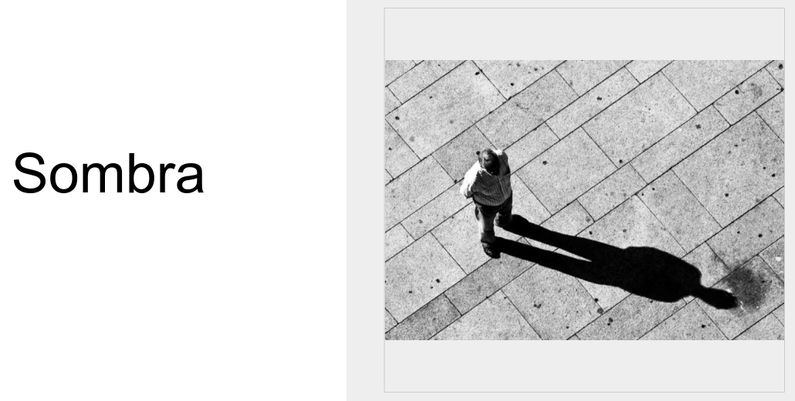

# Modelar la sombra



---
## Diagrama de clases

```
@startuml
    class Luminaria
    class Objeto
    class Sombra
    Luminaria -r-> Objeto
    Luminaria ..> Sombra
    Objeto --> Sombra
    Sombra --> Objeto
@enduml
```
---
## Diagrama de objetos, una luminaria

```
@startuml
    object "foco : Luminaria" as foco
    object "persona : Objeto" as persona
    object "sombraDePersona : Sombra" as sombra
    object "pared : Objeto" as pared
    foco --> persona: ilumina >
    persona --> sombra: proyecta >
    foco ..> sombra: produce >
    sombra ..> pared: proyecta >
@enduml
```
---
## Diagrama de objetos, dos luminarias

```
@startuml
    object "foco_1 : Luminaria" as foco
    object "persona : Objeto" as persona
    object "sombraDePersona : Sombra" as sombra
    object "pared : Objeto" as pared
    object "foco_2 : Luminaria" as foco2
    object "sombraDePersona_2 : Sombra" as sombra2
    foco --> persona: ilumina >
    persona --> sombra: produce >
    foco ..> sombra: produce >
    foco2 --> persona: también ilumina >
    persona --> sombra2: produce >
    foco2 ..> sombra2: produce >
    sombra --> pared: proyecta >
    sombra2 --> pared: proyecta >
@enduml
```

