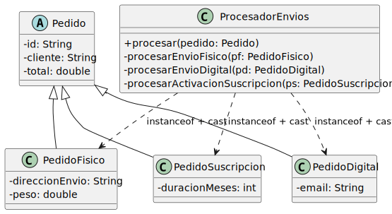

# v000mal — instanceof + casting

`ProcesadorEnvios` discrimina el tipo de pedido con `instanceof` y extrae los datos específicos mediante casting:

<div align=center>

|
|-

</div>

```java
public void procesar(Pedido pedido) {
    if (pedido instanceof PedidoFisico) {
        PedidoFisico pedidoFisico = (PedidoFisico) pedido;
        procesarEnvioFisico(pedidoFisico);
    } else if (pedido instanceof PedidoDigital) {
        PedidoDigital pedidoDigital = (PedidoDigital) pedido;
        procesarEnvioDigital(pedidoDigital);
    } else if (pedido instanceof PedidoSuscripcion) {
        PedidoSuscripcion pedidoSuscripcion = (PedidoSuscripcion) pedido;
        procesarActivacionSuscripcion(pedidoSuscripcion);
    }
}
```

Funciona. El problema aparece cuando llega `PedidoTarjetaRegalo`: hay que abrir `ProcesadorEnvios`, añadir un `else if` y un método nuevo. Un procesador que ya funcionaba debe cambiar por un tipo que no le concierne directamente.

Si hay varios procesadores (envíos, facturación, notificaciones), cada uno replica el mismo bloque `if-else`. El acoplamiento se multiplica.

> Sigue en [v001basico](../v001basico/README.md)
