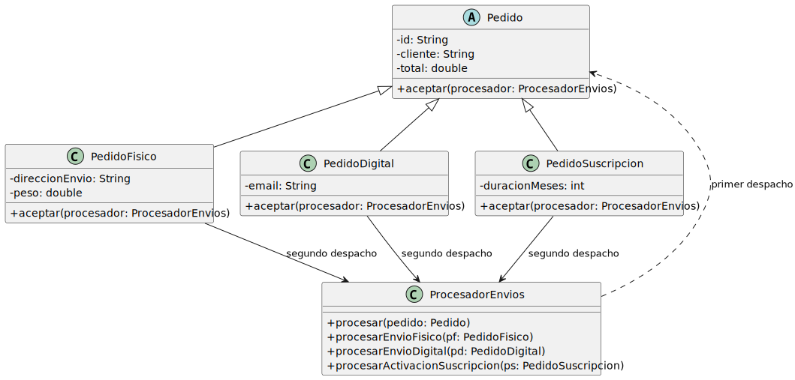
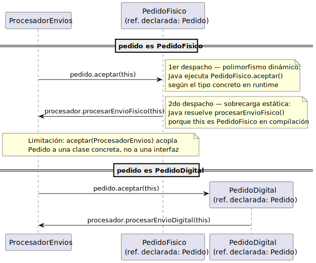

# v001basico — doble despacho manual

El `instanceof` desaparece. Cada `Pedido` sabe cómo delegar al procesador:

<div align=center>

|
|-

</div>

```java
// En ProcesadorEnvios
public void procesar(Pedido pedido) {
    pedido.aceptar(this); // primer despacho
}

// En PedidoFisico
public void aceptar(ProcesadorEnvios procesador) {
    procesador.procesarEnvioFisico(this); // segundo despacho
}
```

Java resuelve qué `aceptar` invocar según el tipo concreto de `pedido` (polimorfismo dinámico). Dentro de `aceptar`, `this` ya tiene tipo estático `PedidoFisico`, así que la sobrecarga `procesarEnvioFisico` se resuelve en tiempo de compilación.

<div align=center>

|
|-

</div>

El problema que queda: `Pedido` está acoplado a `ProcesadorEnvios` directamente. Si aparece `ProcesadorFacturacion`, hay que añadir un `aceptar(ProcesadorFacturacion)` en cada subclase de `Pedido`. La jerarquía crece con cada procesador nuevo.

> Sigue en [v002extensible](../v002extensible/README.md)
