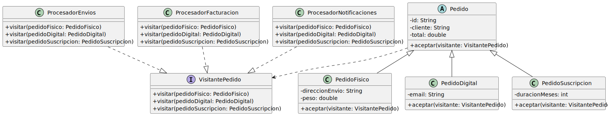
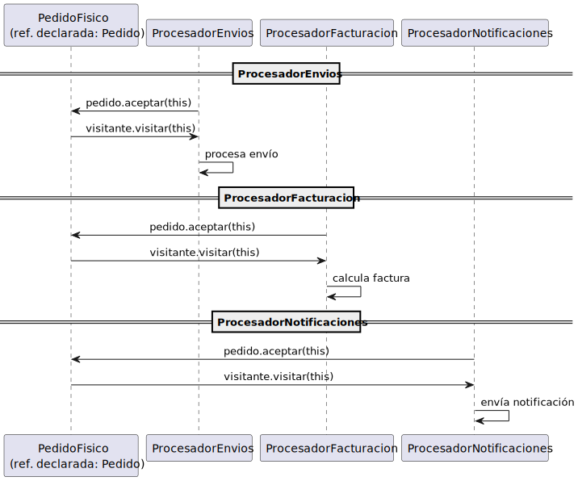

# v002extensible — Visitor con interfaz

`Pedido` deja de conocer procesadores concretos. Solo conoce la interfaz `VisitantePedido`:

<div align=center>

|
|-

</div>

```java
public interface VisitantePedido {
    void visitar(PedidoFisico pedido);
    void visitar(PedidoDigital pedido);
    void visitar(PedidoSuscripcion pedido);
}

// En PedidoFisico
public void aceptar(VisitantePedido visitante) {
    visitante.visitar(this);
}
```

Ahora cualquier clase puede ser visitante implementando la interfaz. Los tres procesadores coexisten sin tocarse entre sí ni tocar los pedidos:

```java
class ProcesadorEnvios      implements VisitantePedido { ... }
class ProcesadorFacturacion implements VisitantePedido { ... }
class ProcesadorNotificaciones implements VisitantePedido { ... }
```

Añadir `ProcesadorAnalytics` no requiere modificar nada existente.

<div align=center>

|
|-

</div>

## Compromiso

La rigidez se desplaza al otro eje: añadir `PedidoTarjetaRegalo` requiere añadir `visitar(PedidoTarjetaRegalo)` a la interfaz e implementarlo en los tres procesadores existentes. Añadir un tipo tiene coste lineal en el número de visitantes.

El Visitor es la herramienta correcta cuando las operaciones crecen y los tipos son estables. Si los tipos cambian frecuentemente, el coste se invierte.
