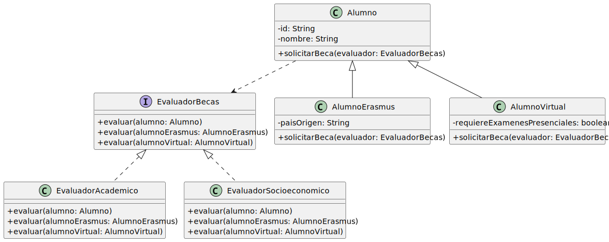
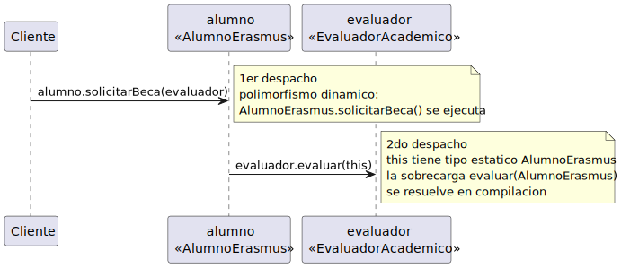

# OCP05 — doble despacho

En OCP04Alternativa, añadir `AlumnoInvestigador` obliga a abrir todos los evaluadores porque cada uno necesita saber con qué tipo de alumno trata. Ese conocimiento, sin embargo, ya lo tiene el alumno: él sabe lo que es.

La solución: el alumno llama al evaluador pasándose a sí mismo.

<table>
<tr>
<td valign=top>



Ningún evaluador usa `instanceof`. Cada alumno resuelve qué método invocar al pasarse como `this`.

</td><td>

```java
// en Alumno
public void solicitarBeca(EvaluadorBecas evaluador) {
    evaluador.evaluar(this);
}

// en AlumnoErasmus
@Override
public void solicitarBeca(EvaluadorBecas evaluador) {
    evaluador.evaluar(this);  // this: AlumnoErasmus
}

// en AlumnoVirtual
@Override
public void solicitarBeca(EvaluadorBecas evaluador) {
    evaluador.evaluar(this);  // this: AlumnoVirtual
}
```

</td>
</tr>
</table>

El código de `solicitarBeca` es idéntico en las tres clases. Lo que cambia es el tipo estático de `this`.

## Cómo funciona

<div align=center>

||
|-|

</div>

1. `alumno.solicitarBeca(evaluador)` — el tipo concreto de `alumno` determina qué `solicitarBeca` se ejecuta. Primer despacho: polimorfismo dinámico en tiempo de ejecución.

2. Dentro de `AlumnoErasmus.solicitarBeca()`, `this` tiene tipo estático `AlumnoErasmus`. La llamada `evaluador.evaluar(this)` resuelve la sobrecarga `evaluar(AlumnoErasmus)` en tiempo de compilación. Segundo despacho: sobrecarga estática.

## Compromiso

Añadir `EvaluadorDeportes` es libre: implementar `EvaluadorBecas` sin tocar nada más.

Añadir `AlumnoInvestigador` tiene coste: hay que añadir `evaluar(AlumnoInvestigador)` a la interfaz y a cada implementación existente. El doble despacho es extensible en el eje de los evaluadores, no en el de los tipos.

> Ver también: [doble despacho](../../../temario/03-diseñoOO/dobleDespacho.md)
