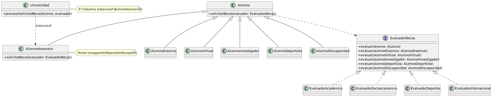

# OCP07 - Requisitos++

OCP05Extendido funciona con elegancia: cinco tipos de alumno, cuatro evaluadores, cero `instanceof`. El doble despacho hace su trabajo en silencio.

Llega un nuevo requisito.

## Un requisito

La universidad quiere incorporar alumnos honorarios - académicos visitantes, asistentes no matriculados en el sentido tradicional. Necesitan estar en el sistema, pero no son elegibles para becas.

Un desarrollador razona con toda la lógica del mundo:

```java
class AlumnoHonorario extends Alumno {
    @Override
    public void solicitarBeca(EvaluadorBecas evaluador) {
        throw new UnsupportedOperationException("Los alumnos honorarios no solicitan becas");
    }
}
```

Compila. Parece razonable. Se despliega.

Ya vimos este patrón antes: [herencia por limitación](../../../../temario/01-diseño/02-relacionesClases.md). Y ya sabíamos que no era deseable.

## El sistema

La primera vez que `Universidad` procesa un `AlumnoHonorario`, la excepción sube. El sistema que eliminó el `instanceof` en cinco iteraciones revienta en el primer caso real.

Y dado que el sistema tiene que seguir funcionando, bajo presión, alguien añade la guardia...

<table>
<tr>
<td valign=top>



`Universidad` - que dependía únicamente de la abstracción `Alumno` - ahora se acopla a una clase concreta. La abstracción está rota.

</td><td>

```java
public class Universidad {
    public void procesarSolicitudBeca(Alumno alumno,
                                      EvaluadorBecas evaluador) {
        if (!(alumno instanceof AlumnoHonorario)) {
            alumno.solicitarBeca(evaluador);
        }
    }
}
```

</td>
</tr>
</table>

El `instanceof` ha vuelto. Hay tres salidas posibles:

|Sacar `AlumnoHonorario` de la jerarquía|Renegociar el contrato de la base|Camino C - Composición|
|-|-|-|
No extiende `Alumno`. Es una clase independiente que `Universidad` gestiona por separado. Si realmente no comparte el contrato, quizá no debería estar en la jerarquía. Pero implica duplicar toda la lógica de "estar en el sistema".|`solicitarBeca()` en `Alumno` pasa a ser un no-op por defecto. `AlumnoHonorario` hereda sin sobreescribir, no explota. Pero el contrato queda debilitado para todos: el evaluador ya no puede asumir que será llamado.|La capacidad de solicitar beca se extrae como pieza componible. `Alumno` la delega. `AlumnoHonorario` recibe una implementación nula: no lanza, no hace nada, no viola el contrato. El sistema de OCP05Extendido queda intacto.

> Sigue en [OCP08](../OCP08/README.md)
