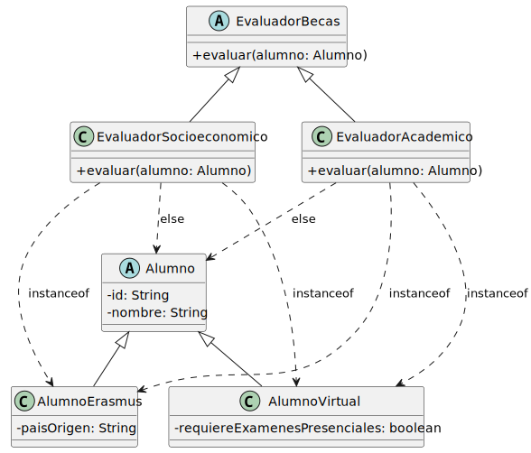
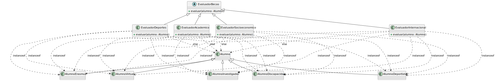

# Limitaciones

El sistema de becas tiene una jerarquía de alumnos y necesita evaluarlos. El punto de partida es razonable: un único evaluador que recibe un `Alumno` y decide qué hacer.

## Un evaluador, todos los tipos

```java
public class EvaluadorBecas {
    public void evaluar(Alumno alumno) {
        if (alumno instanceof AlumnoErasmus) {
            AlumnoErasmus erasmus = (AlumnoErasmus) alumno;
            // criterios de movilidad
        } else if (alumno instanceof AlumnoVirtual) {
            AlumnoVirtual virtual = (AlumnoVirtual) alumno;
            // criterios de educación a distancia
        } else {
            // criterios estándar
        }
    }
}
```

Funciona. El problema aparece cuando llega `AlumnoInvestigador`: hay que abrir `EvaluadorBecas`, añadir un `else if` y conocer los detalles del nuevo tipo. Un evaluador que ya funcionaba debe cambiar por un tipo que no le concierne directamente.

## Una jerarquía de evaluadores

La mejora natural: separar los criterios en subclases especializadas, una por tipo de evaluación.

<table>
<tr>
<td valign=top>



Cada evaluador aplica sus propios criterios sin interferir con los demás. Funciona.

</td><td>

```java
public class EvaluadorAcademico extends EvaluadorBecas {
    public void evaluar(Alumno alumno) {
        if (alumno instanceof AlumnoErasmus) {
            // expediente internacional
        } else if (alumno instanceof AlumnoVirtual) {
            // rendimiento online
        } else { ... }
    }
}

public class EvaluadorSocioeconomico extends EvaluadorBecas {
    public void evaluar(Alumno alumno) {
        if (alumno instanceof AlumnoErasmus) {
            // baremos internacionales
        } else if (alumno instanceof AlumnoVirtual) {
            // costes conectividad
        } else { ... }
    }
}
```

</td>
</tr>
</table>

¿Qué ocurre cuando llega `AlumnoInvestigador`? Hay que abrir **todos** los evaluadores existentes y añadir un `else if` en cada uno. Añadir un tipo de alumno tiene coste N — uno por cada evaluador.

## A escala

<div align=center>

||
|-|

</div>

> Sigue en [la solución](solucion.md)
