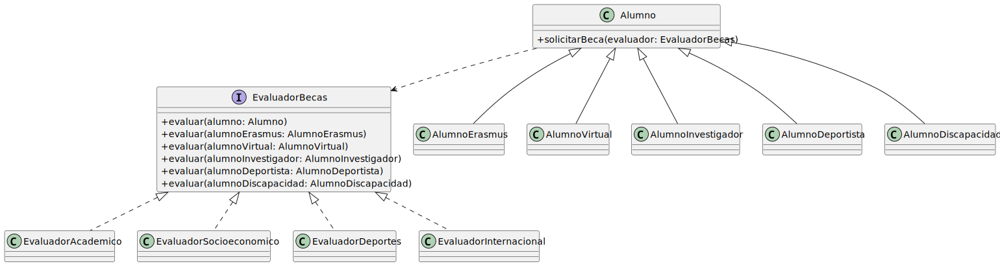

# Solución: doble despacho

El problema de `OCP04Alternativa` es que cada evaluador necesita saber con qué tipo concreto de alumno trata. Ese conocimiento, sin embargo, ya lo tiene el alumno: él sabe lo que es.

La solución: invertir el control. El alumno llama al evaluador pasándose a sí mismo.

## El mecanismo

<table>
<tr>
<td valign=top>


`EvaluadorBecas` es la interfaz que conecta las dos jerarquías. Ningún evaluador usa `instanceof`.

</td><td>

```java
interface EvaluadorBecas {
    void evaluar(Alumno alumno);
    void evaluar(AlumnoErasmus alumnoErasmus);
    void evaluar(AlumnoVirtual alumnoVirtual);
}

// en Alumno
public void solicitarBeca(EvaluadorBecas evaluador) {
    evaluador.evaluar(this);
}

// en AlumnoErasmus
@Override
public void solicitarBeca(EvaluadorBecas evaluador) {
    evaluador.evaluar(this);  // this: AlumnoErasmus
}
```

</td>
</tr>
</table>

El código de `solicitarBeca` es idéntico en todas las clases. Lo que cambia es el tipo estático de `this`.

**Primer despacho:** `alumno.solicitarBeca(evaluador)` — el tipo concreto de `alumno` determina qué `solicitarBeca` se ejecuta. Polimorfismo dinámico en tiempo de ejecución.

**Segundo despacho:** dentro de `AlumnoErasmus.solicitarBeca()`, `this` tiene tipo estático `AlumnoErasmus`. La llamada `evaluador.evaluar(this)` resuelve la sobrecarga `evaluar(AlumnoErasmus)` en tiempo de compilación.

## A escala

Con 5 tipos de alumno y 4 evaluadores:

<table>
<tr>
<td valign=top align=center>


*Bajo OCP04Alternativa*

</td>
<td valign=top align=center>



*Con doble despacho*

</td>
</tr>
</table>

## Compromisos

**Añadir `EvaluadorDeportes`:** implementar `EvaluadorBecas`. Sin tocar nada más.

**Añadir `AlumnoDiscapacidad`:** crear la clase, añadir `evaluar(AlumnoDiscapacidad)` a la interfaz e implementarlo en cada evaluador existente. El compilador señala exactamente qué falta — no hay forma de olvidarse.

El coste existe. La diferencia con `OCP04Alternativa` es que aquí es visible, localizado y verificable.
